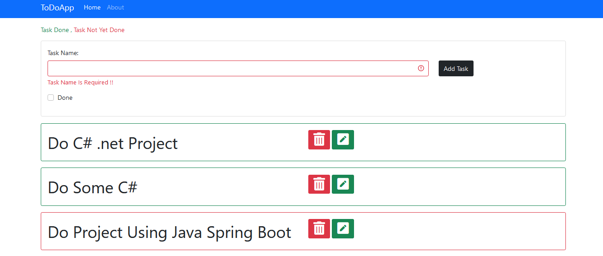
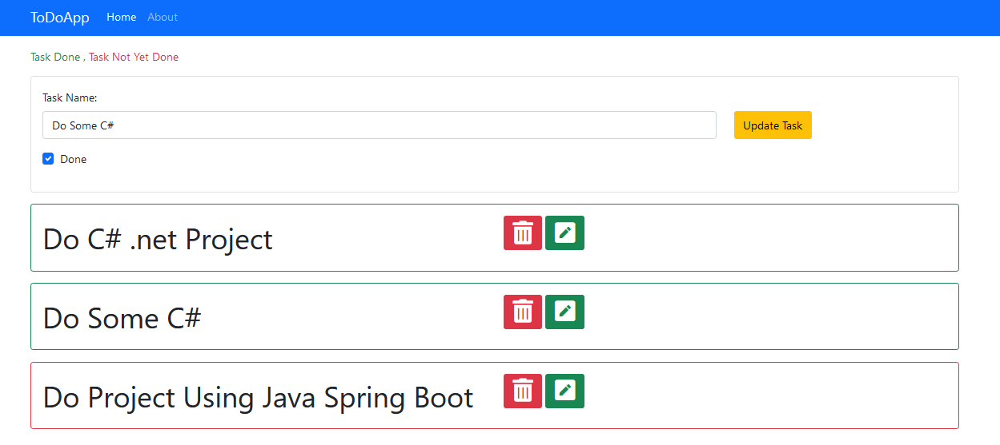

# A Todo App For Managing Items C# / .net Core 5.0 / Angular

---

## 

---

## Description

- My First FullStack App Using .net core 5.0 / Angular

#### Fonctionnalites

- Crud Tasks
- Validation Client Side Using Template Deriven Forms

---

#### Technologies

- C# / .Net Core 5
- Angular
- Entity framework
- SQLITE
- Bootstrap4 / jQuery

---

#### To Run

- Run Using .net Cli   `1 cd Backend/API `   `2 dotnet watch run ` To Run The Serve
- Run The Client  `1 cd Frontend `   `ng serve --open`

#### Tools

- Viscode + C# Extension Pack
- SQLite
- PostMan
